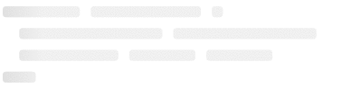

# Vue Skeleton

### Vue component to easily build or use presets for Facebook-like SVG loading cards.

## So how does it look like?

Facebook

Code

## Installation

Simple installation via NPM

``$ npm install vue-skeleton --save``

##### License

This project is licensed under the MIT license. See the [LICENSE file](./LICENSE) for more details
